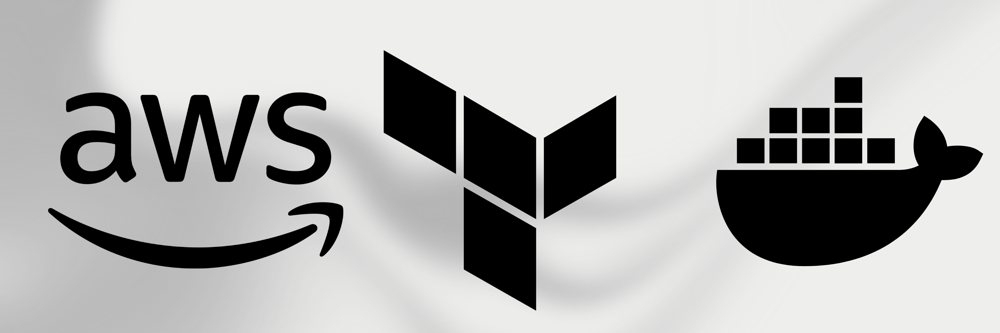
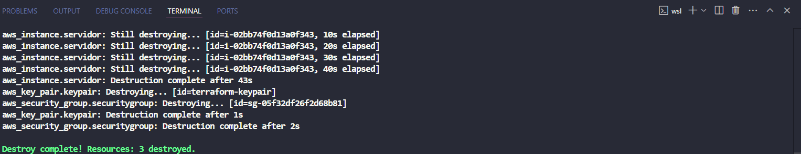

# Terraform AWS EC2 Docker 

Este repositório contém um projeto de Infraestrutura como Código (IaC) utilizando **Terraform** para provisionar um servidor EC2 na **AWS**, configurar controle de acesso com Security Groups e realizar o deploy de uma aplicação Spring Boot simples dentro de um container **Docker**.<p> 



## Descrição

O objetivo deste projeto é demonstrar a criação e gerenciamento de infraestrutura na AWS usando Terraform. A aplicação principal é um simples projeto Spring Boot que retorna a hora atual, que foi containerizada usando Docker e publicada no Docker Hub. A infraestrutura é configurada para permitir acesso remoto via SSH e HTTP.<p>


## Arquitetura

A infraestrutura criada inclui:

- **EC2 Instance:** Um servidor na AWS para hospedar a aplicação.
- **Security Groups:** Configuração de firewall para permitir acesso HTTP e SSH.
- **Docker Container:** A aplicação Spring Boot é executada dentro de um container Docker.
- **AWS CLI:** Utilizado para configurar as credenciais de acesso programático.

## Pré-requisitos

- [Terraform](https://www.terraform.io/downloads.html) instalado
- [AWS CLI](https://aws.amazon.com/cli/) configurado
- Conta na AWS com permissões para criar recursos
- [Docker](https://docs.docker.com/get-docker/) instalado

## Passo a Passo

### 1. Iniciar o Projeto Spring Boot

- Criação de um projeto Spring Boot simples que exibe a hora atual.

### 2. Publicar a Aplicação no Docker Hub

- A aplicação foi containerizada usando Docker.
- O container foi publicado no [Docker Hub](https://hub.docker.com/repository/docker/leonardoframos/public-api/general).

### 3. Configuração da Infraestrutura

- Inicialize o projeto Terraform:
    ```bash
    terraform init
    ```

- Crie um usuário programático na AWS e configure as credenciais usando o AWS CLI:
    ```bash
    aws configure
    ```

- Configure o servidor EC2 via Terraform, especificando as regras de segurança:
    ```bash
    terraform plan
    ```

- Adicione o script de inicialização (`user_data.sh`) para configurar a instância durante a inicialização.

### 4. Deploy e Testes

- Realize o deploy da infraestrutura:
    ```bash
    terraform apply
    ```
    


- Teste a API acessando o endereço IP público da instância EC2.
  


- Configure o par de chaves (KeyPair) para acesso SSH via Terraform.

- Teste o acesso remoto via SSH.
  
- Container em execução:
  
 

### 5. Limpeza

- Após testar a infraestrutura, realize a limpeza dos recursos:
    ```bash
    terraform destroy
    ```
    
  - Confirmação de exclusão
    
  - Todos os recursos foram excluídos
    
 


## Conclusão

Este projeto demonstra como criar e gerenciar uma infraestrutura na AWS usando Terraform, incluindo a configuração de segurança e deploy de aplicações containerizadas. Todos os passos foram automatizados para facilitar a replicação do ambiente.
